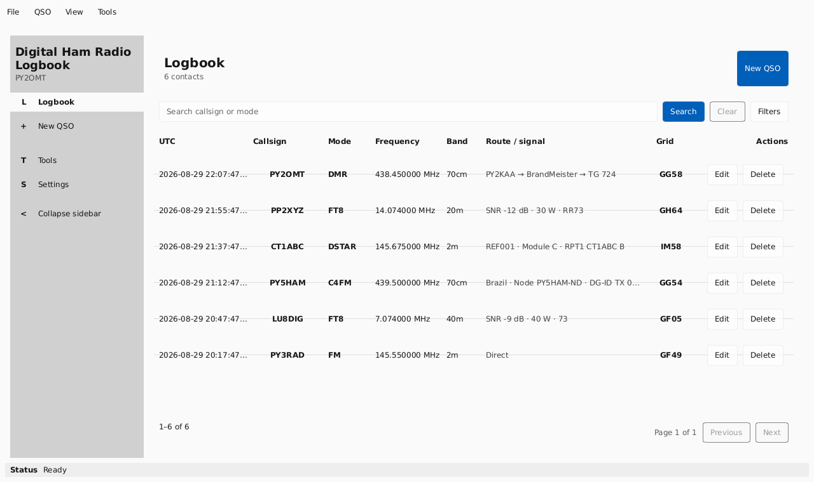

# Digital Ham Radio Logbook

[](https://github.com/marcelositr/DigitalHamRadioLogbook/actions/workflows/ci.yml)

Aplicativo desktop para registro e organização de contatos de radioamador, desenvolvido em **Rust**, **Slint** e **SQLite**. O projeto é local-first, funciona offline e oferece fluxos dedicados para modos digitais e interoperabilidade ADIF.



*Interface v0.11 em Dark mode. A captura usa QSOs sintéticos de demonstração.*

## Principais recursos

- registro, pesquisa, edição e exclusão de QSOs;
- suporte a contatos genéricos, DMR, FT8, D-STAR e YSF/System Fusion (`C4FM`);
- filtros e listagem paginada para operação diária;
- importação e exportação ADIF, incluindo preservação de campos desconhecidos;
- backup SQLite, verificação de backup e health check local;
- interface Slint com style Fluent e esquemas **System**, **Light** e **Dark**.

Os dados permanecem no computador do usuário. O projeto não exige conta, serviço em nuvem ou sincronização online para manter o logbook.

## Executar a partir do código

O toolchain Rust usado pelo projeto é fixado em `rust-toolchain.toml`.

```sh
cargo run --locked
```

Para instalação e distribuição no GNU/Linux, consulte [Linux distribution](docs/operations/LINUX-DISTRIBUTION.md).

## Documentação

O [GitHub Wiki](https://github.com/marcelositr/DigitalHamRadioLogbook/wiki) concentra instalação, uso e orientação ao usuário. A documentação de engenharia está organizada em [docs/](docs/README.md), com arquitetura, contratos de dados, qualidade, operações e processo de release.

Consulte também o [changelog](docs/releases/CHANGELOG.md), as [release notes do v0.11.0-RC1](docs/releases/notes/RELEASE-NOTES-v0.11.0-RC1.md) e a [matriz de suporte](docs/operations/SUPPORT-MATRIX.md).

## Status do projeto

O projeto permanece em desenvolvimento pré-1.0. A linha v0.11 está em **release candidate** (`0.11.0-rc.1`) e continua em avaliação; este candidato não representa uma release estável ou uma declaração de prontidão final.

## Licença

Distribuído sob a [MIT License](LICENSE).
